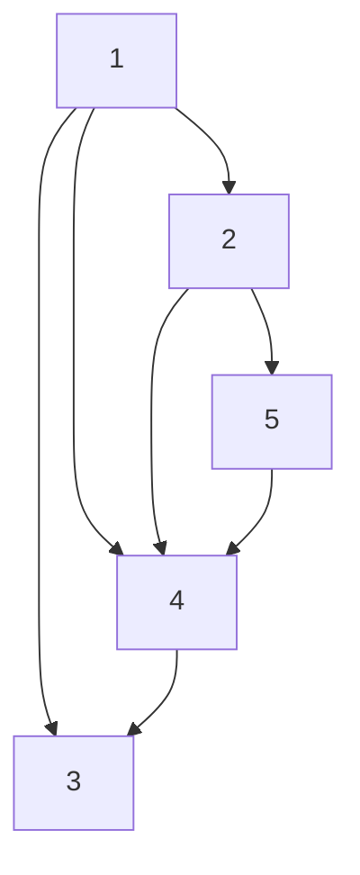

# Adjacency List

A structure for representing a graph by storing each individual node's relation
to other nodes within the graph.

Imagine the following graph:



## Instantiate (Directed)

In a directed graph, the pair of nodes only go in one direction (left to right).

```kotlin
fun <T> adjacencyListOf(vararg pairs: Pair<T, T>): MutableMap<T, MutableList<T>> = 
    mutableMapOf<T, MutableList<T>>().apply {
        pairs.forEach { getOrPut(it.first, ::mutableListOf).add(it.second) }
    }

adjacencyListOf(1 to 2, 1 to 3, 1 to 4, 2 to 4, 2 to 5, 4 to 3, 5 to 4)
```

## Instantiate (Undirected)

In an undirected graph, the pair of nodes can traverse in both directions.

```kotlin
fun <T> adjacencyListOf(vararg pairs: Pair<T, T>): MutableMap<T, MutableList<T>> = 
    mutableMapOf<T, MutableList<T>>().apply {
        pairs.forEach { 
            getOrPut(it.first, ::mutableListOf).add(it.second)
            getOrPut(it.second, ::mutableListOf).add(it.first)
        }
    }

adjacencyListOf(1 to 2, 1 to 3, 1 to 4, 2 to 4, 2 to 5, 4 to 3, 5 to 4)
```
