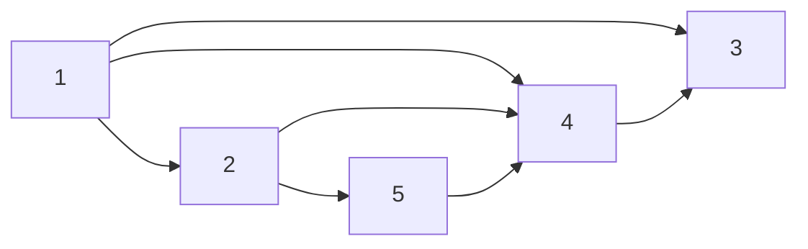

# Adjacency List

A structure for representing a graph by storing each individual node's relation
to other nodes within the graph.

Adjacency lists are useful for when nodes in the aggregate need to be operated on, as
the adjacency list offers constant time access to each node.

Imagine the following graph:



## Instantiate (Directed)

In a directed graph, the pair of nodes only go in one direction (left to right).

```kotlin
fun <T> adjacencyListOf(vararg pairs: Pair<T, T>): MutableMap<T, MutableList<T>> = 
    mutableMapOf<T, MutableList<T>>().apply {
        pairs.forEach { getOrPut(it.first, ::mutableListOf).add(it.second) }
    }

adjacencyListOf(1 to 2, 1 to 3, 1 to 4, 2 to 4, 2 to 5, 4 to 3, 5 to 4)
```

## Instantiate (Undirected)

In an undirected graph, the pair of nodes can traverse in both directions.

```kotlin
fun <T> adjacencyListOf(vararg pairs: Pair<T, T>): MutableMap<T, MutableList<T>> = 
    mutableMapOf<T, MutableList<T>>().apply {
        pairs.forEach { 
            getOrPut(it.first, ::mutableListOf).add(it.second)
            getOrPut(it.second, ::mutableListOf).add(it.first)
        }
    }

adjacencyListOf(1 to 2, 1 to 3, 1 to 4, 2 to 4, 2 to 5, 4 to 3, 5 to 4)
```

## Breadth-First Search

Visit all of the nodes at the depth before advancing to the next depth.
We can utilize a queue to achieve the "breadth" and a visited-set to prevent cycles.

```kotlin
fun <T> Map<T, List<T>>.bfs(): Unit {
    val visited: MutableSet<T> = mutableSetOf()
    val queue: MutableList<T> = mutableListOf(keys.first())

    while (queue.isNotEmpty()) {
        queue.removeFirst().takeIf { it !in visited }?.let {
            
            // -- Do Stuff --

            this[it]?.let(queue::addAll)
            visited.add(it)
        }
    }
}
```

## Depth-First Search

Visit a single edge to the end before visiting any other nodes.
We can utilize a stack to achieve the "depth" and a visited-set to prevent cycles.

```kotlin
fun <T> Map<T, List<T>>.dfs(): Unit {
    val visited: MutableSet<T> = mutableSetOf()
    val stack: MutableList<T> = mutableListOf(keys.first())

    while (stack.isNotEmpty()) {
        stack.removeLast().takeIf { it !in visited }?.let {
            
            // -- Do Stuff --

            this[it]?.let(stack::addAll)
            visited.add(it)
        }
    }
}
```

## Transpose

Reverse all of the edges in a directed graph.

```kotlin
fun <T> Map<T, List<T>>.transpose(): MutableMap<T, MutableList<T>> =
    mutableMapOf<T, MutableList<T>>().apply {
        this@transpose.entries.forEach { (key, value) ->
            value.forEach { getOrPut(it, ::mutableListOf).add(key) }
        }
    }
```
