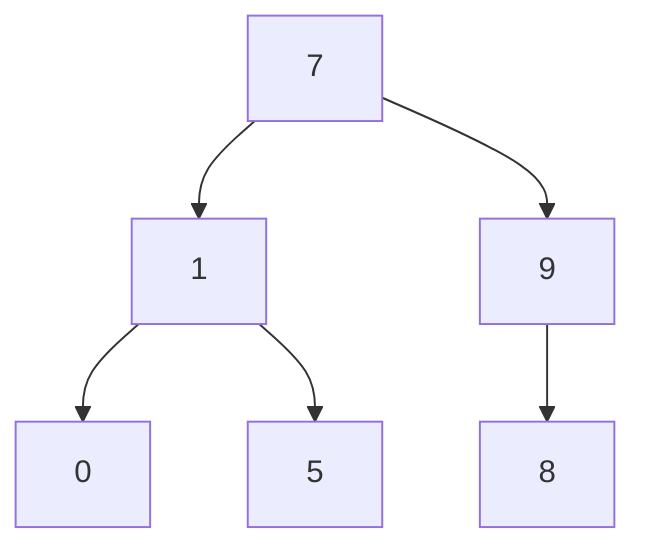
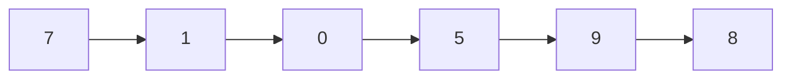
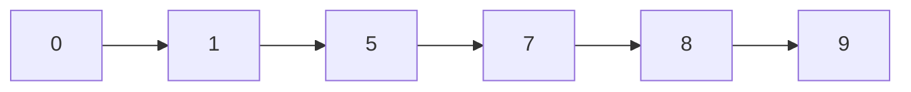
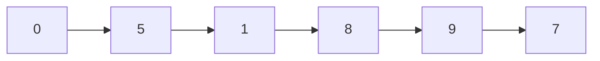

# Binary Tree

A tree where each node has at most two children, left and right.

Imagine the following binary-search tree:



## Instantiate

A binary tree really doesn't have much more than this, we would need to know more properties to do more.

```kotlin
data class BinaryNode<T>(
    val value: T,
    var left: BinaryNode<T>? = null,
    var right: BinaryNode<T>? = null,
)
```

To manually implement the graph above:

```kotlin
val root = BinaryNode(
    value = 7,
    left = BinaryNode(
        value = 1,
        left = BinaryNode(0),
        right = BinaryNode(5),
    ),
    right = BinaryNode(
        value = 9,
        left = BinaryNode(8),
    )
)
```

## Pre-Order Traversal

Visit the root, left, and then right.



```kotlin
fun <T> BinaryNode<T>.preorder(visit: (T) -> Unit): Unit {
    visit(value)
    left?.preorder(visit)
    right?.preorder(visit)
}

root.preorder(::println)
```

## In-Order Traversal

Visit the left, root, and then right.



```kotlin
fun <T> BinaryNode<T>.inorder(visit: (T) -> Unit): Unit {
    left?.inorder(visit)
    visit(value)
    right?.inorder(visit)
}

root.inorder(::println)
```

## Post-Order Traversal

Visit the left, right, and then root.



```kotlin
fun <T> BinaryNode<T>.postorder(visit: (T) -> Unit): Unit {
    left?.postorder(visit)
    right?.postorder(visit)
    visit(value)
}

root.postorder(::println)
```

## Contains (Binary Search)

Checks whether a comparable element is within the binary tree.

```kotlin
operator fun <T : Comparable<T>> BinaryNode<T>.contains(element: T): Boolean = when {
    value < element -> right?.contains(element) ?: false
    value > element -> left?.contains(element) ?: false
    else -> true
}
```

## Add (Comparable)

Adds a comparable element to the binary tree.

```kotlin
fun <T : Comparable<T>> BinaryNode<T>.add(element: T): Unit {
    if (value < element) {
        if (right == null) right = BinaryNode(element)
        else right?.add(element)
    }
    else if (value > element) {
        if (left == null) left = BinaryNode(element)
        else left?.add(element)
    }
}
```
