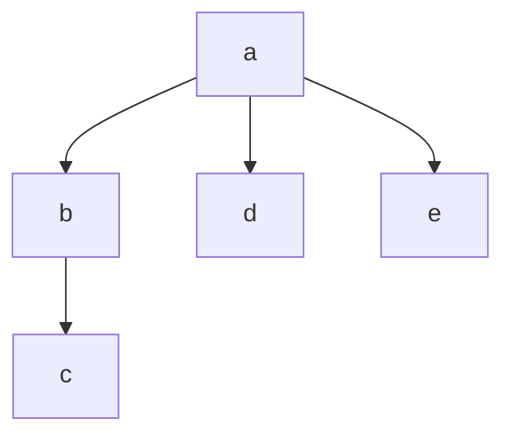

# Tree

Trees are a special graph that are normally "rooted" (they start
from a single node), are directed, and acyclic. They can have multiple
children that extend from it.



## Instantiate

```kotlin
data class Node<T>(val value: T, val children: MutableList<Node<T>> = mutableListOf())
```

## Add

Add a value to the tree.

```kotlin
fun <T> Node<T>.add(value: T): Node<T> = Node(value).also { children.add(it) }

val root = Node('a').apply {
    add('b').apply { add('c') }
    add('d')
    add('e')
}
```

## Breadth-First Search

Visit all of the nodes at the depth before advancing to the next depth.

```kotlin
fun <T> Node<T>.bfs(visit: (Node<T>) -> Unit) {
    val queue: MutableList<Node<T>> = mutableListOf(this)

    while(queue.isNotEmpty()) {
        queue.removeFirst().let {
            visit(it)
            queue.addAll(it.children)
        }
    }
}
```

## Depth-First Search

Visit a single edge to the end before visiting any other nodes.

```kotlin
fun <T> Node<T>.dfs(visit: (Node<T>) -> Unit) {
    val stack: MutableList<Node<T>> = mutableListOf(this)

    while(stack.isNotEmpty()) {
        stack.removeLast().let {
            visit(it)
            stack.addAll(it.children)
        }
    }
}
```

## Find

Find the first element matching the given predicate.

```kotlin
fun <T> Node<T>.find(predicate: (T) -> Boolean): Node<T>? {
    var node: Node<T>? = null
    dfs { if (predicate(it.value)) node = it; return@dfs }
    return node
}
```
