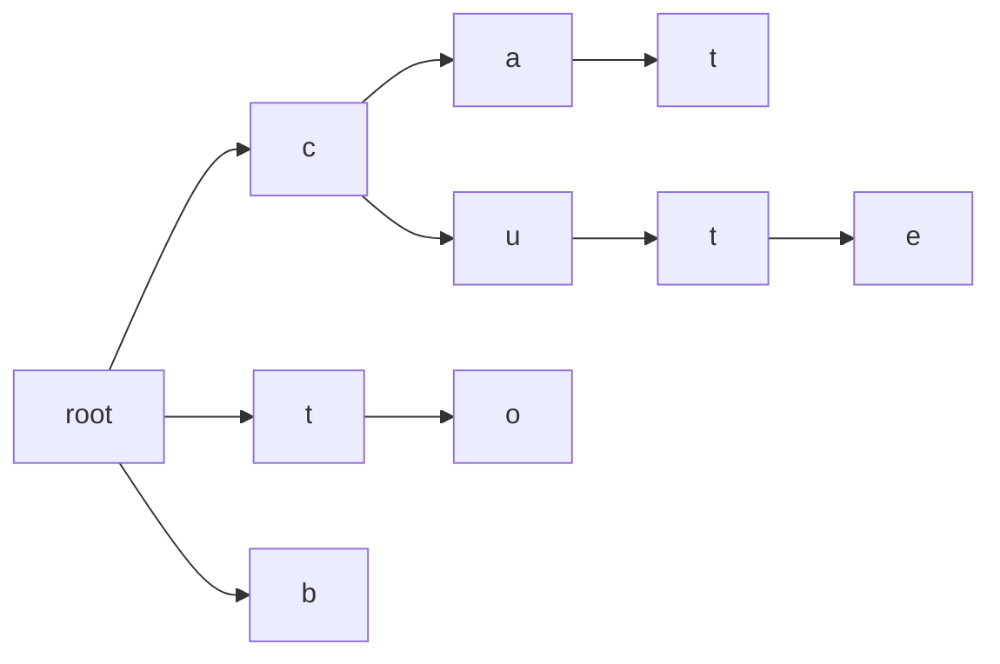

# Trie

A tree speciailized in storing and re-_trie_-ving data that can be reprsented as a collection.
Commonly used when words and dictionaries are involved.

Here is a trie containing the words "cat", "cut", "cute", "to", and "b":



## Instantiate

This trie can be made generic by treating the specific references to `Char` as a generic type and references
to `String` as a collection of that generic type. However, this one just assumes we're using it for words.

```kotlin
class Trie {
    data class Node(
        val key: Char,
        var end: Boolean = false, 
        val children: MutableMap<Char, Node> = mutableMapOf(),
    )
    
    val root = Node('\u0000')
}
```

## Insert

Inserts a word into the trie.

```kotlin
fun Trie.insert(word: String) {
    word.fold(root) { node, char -> node.children.getOrPut(char) { Trie.Node(char) } }
        .end = true
}
```

## Contains

Check if the trie contains a given word.

```kotlin
operator fun Trie.contains(word: String): Boolean =
    word.fold(root) { node, char -> node.children.getOrElse(char) { return false } }
        .end == true
```

## Starts With

Collect all words that starts with a given prefix. e.g. "autocomplete".

```kotlin
fun Trie.startsWith(prefix: String): List<String> {
    fun Trie.Node.collectAll(prefix: String): List<String> =
        (if (end) mutableListOf(prefix) else mutableListOf()).apply {
            addAll(children.values.flatMap { it.collectAll(prefix + it.key) })
        }
    
    return prefix.fold(root) { node, char -> node.children.getOrElse(char) { return emptyList() } }
        .collectAll(prefix)
}
```
